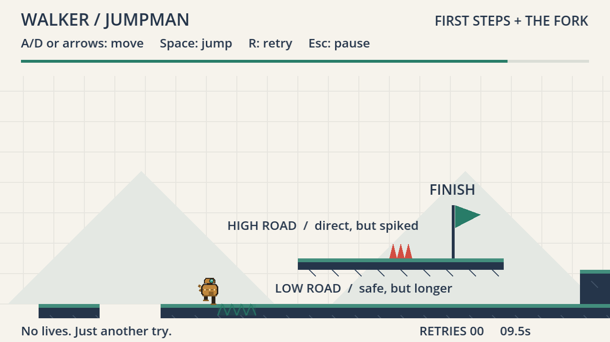
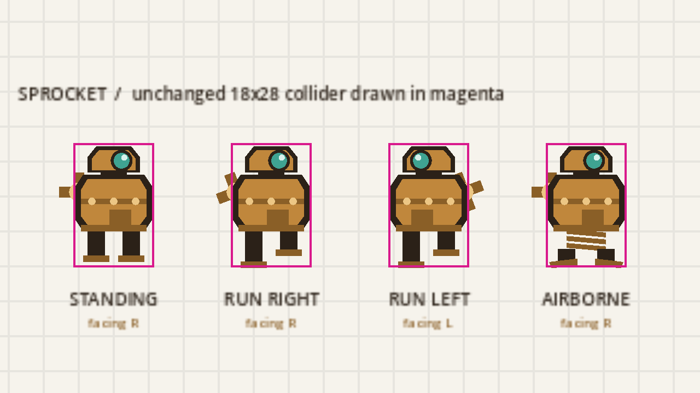
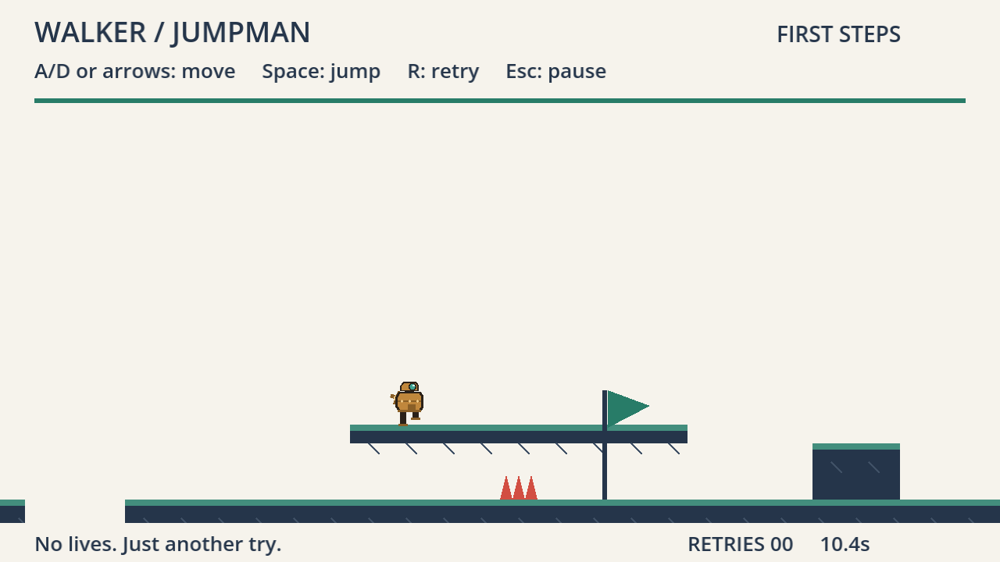

# walker-jumpman-tharun-m

**CSYE 7270 · Fall 2026 · Assignment 1 — Extend Walker Jumpman**
**Tharun Maheswararao** · `maheswararao.t@northeastern.edu`

An extension of the course starter: a new main character, **SPROCKET** the
wind-up tin automaton, and a new playable section, **03 / THE FORK**, which
roughly doubles the course and moves the finish behind it.



---

## Starter credit

This is an extension of **[nikbearbrown/walker-jumpman](https://github.com/nikbearbrown/walker-jumpman)**
by Nik Bear Brown, at commit `9387542`. It is **not** a new game.

The unmodified starter is committed here as the first commit, `8c9085d`, so
every change in this repository is a reviewable diff against the instructor's
original. The starter's own design package is preserved unchanged
(`GDD.md`, `LEVEL-DESIGN.md`, `BUILD-REPORT.md`, `design/`, and the rest), its
README is kept at [starter-docs/STARTER-README.md](starter-docs/STARTER-README.md),
and its test evidence is in [`evidence/baseline/`](evidence/baseline/).

## Engine

**Godot `4.7.2.stable.official.ed1daf0bf`** — the exact build the starter names
as its tested engine. No .NET runtime, no plugins, no external assets.

Developed and tested on macOS 15.6 (Darwin 24.6.0), Apple M4, OpenGL
Compatibility renderer.

## Run it

Install Godot 4.7.2 (on macOS: `brew install --cask godot`), then either
double-click [`walker-jumpman.command`](walker-jumpman.command), or:

```bash
godot --path godot
```

Or import `godot/project.godot` in the Godot editor and press Play.

## Controls

Unchanged from the starter.

| Key | Action |
| --- | --- |
| **A / D** or **← / →** | Move |
| **Space** | Jump (one fixed-height jump, no double jump) |
| **R** | Restart the attempt (dying already restarts on its own) |
| **Esc / P** | Pause · **Enter** resumes |
| **Enter** | Start, resume, or play again |
| **M** | Main menu (from pause or completion) |

Reach the flag. Retries are unlimited and a manual retry does not count as a
death.

## What I changed

### 1. The character — SPROCKET, a wind-up tin automaton

The starter draws its character in `godot/features/player/player.gd::_draw()`
as seven flat rectangles with a sliding cream visor. There is no sprite sheet.
I replaced that drawing entirely:



* A **chamfered brass barrel** torso — the cut corners change the actual
  outline, so the silhouette differs from the starter's plain rectangle even
  as a flat black shape.
* A **narrow domed head** with a single round **teal lens** — the starter has
  no curves anywhere.
* A **winding key on the back**. This is the facing tell: it always sits on the
  *trailing* side and flips when SPROCKET turns, and its prongs **rotate while
  running** and **freeze in the air**.
* **Piston legs** that alternate as a stride when grounded and **retract into a
  visible coil** with splayed foot pads when airborne, so the jumping pose is
  unmistakably not the standing pose.

**Physics, tuning and the collider are untouched.** The collider is still an
18×28 box at offset (0, −14); all eight values in `tuning.gd` are unchanged, and
`test_extension.gd` asserts both. The whole body is drawn inside the collider —
the topmost drawn pixel is at −27.5 against a collider top of −28. The **one**
deliberate exception is the winding key, which extends **3.50 px** past the
collider's side wall on the trailing side; that number is derived from the same
constants the drawing uses and is asserted by a test rather than eyeballed.

### 2. The level — section 03 "The Fork"

The course goes from 960 px to **2080 px** and the flag moves from x = 916 to
**x = 1824**. Every original solid, the original spike and the spawn keep their
exact coordinates; only the finish moved.

Left to right, the new section is: **The Junction** (a 64 px gap jump), **two
narrow 64 px stepping stones** over real pits, a **ground run**, and then the
fork itself — two ways to the same flag:

| | **HIGH ROAD** | **LOW ROAD** |
| --- | --- | --- |
| How | Jump 48 px up onto a thin terrace | Ignore it; run the ground underneath |
| Risk | A spike bank on the walkway | Nothing to miss, nothing to hit |
| Cost | The hardest jump in the game (48 px against a 56 px apex) | The only way up is **past the flag**, so you must double back |
| Measured | **666 ticks / 11.15 s** | **803 ticks / 13.43 s** |

The trade-off is **measured, not asserted**: `low-road-is-slower-than-high-road`
records a **2.28 s** difference. Horizontal speed in this engine is a constant
160 px/s airborne as well as grounded, so distance travelled is the only thing
that can separate the two roads — which is exactly why the low road's cost is
built out of doubling back rather than out of "going slower".

Failing the high road is forgiving by design: mistime the terrace jump and you
smack its left face, drop back to the ground, and are simply on the low road.

Seven new landings require a jump. The assignment asks for two.

### 3. Making the picture agree with the physics

The starter builds collision from the level JSON but draws the world from
numbers hard-coded to a 960 px course. Widening the level alone therefore
produces a broken picture. One frame, captured by running the **starter's**
drawing code against **my** level data, shows three of these at once:



* The raised spike bank is painted on the **ground**, 64 px below the trigger
  the player is actually walking into — an invisible killer plus a decorative
  fake. `_add_area()` honoured the data; `_draw()` hard-coded `y = 320`.
* The backdrop and grid are **absent** through the whole new region.
* The progress bar is **already full** with the flag still ahead.
* The finish pole is drawn from the ground baseline and **spears through** the
  terrace instead of standing on it.

All of it now reads from the level data. `hazard_triangle()` is the single
definition of a spike's shape, called by both the trigger builder and the
renderer, so they cannot drift apart again — and a test asserts it.

### 4. A painted launch guide

The terrace take-off window is x 1580–1618, which is *before* the terrace
starts at 1664 — so the instinctive move, run up under it and jump, bonks. A
chevron band is painted on the ground at exactly the measured window, driven
from level data so the paint and the physics describe the same span. It has no
collision. This came from looking at a screenshot, not from a failing test.

## Verification

| Suite | Checks | Failures |
| --- | ---: | ---: |
| `tests/test_game.gd` (starter's) | 25 | **0** |
| `tests/test_keyboard.gd` (starter's, byte-identical) | 9 | **0** |
| `tests/test_extension.gd` (new) | 23 | **0** |
| **Total** | **57** | **0** |

```bash
/Applications/Godot.app/Contents/MacOS/Godot --headless --path godot --script res://tests/test_game.gd
```
```bash
/Applications/Godot.app/Contents/MacOS/Godot --headless --path godot --script res://tests/test_keyboard.gd
```
```bash
/Applications/Godot.app/Contents/MacOS/Godot --headless --path godot --script res://tests/test_extension.gd
```

Level geometry is designed against the **measured** jump envelope, not textbook
arithmetic. `godot/tools/probe_jump.gd` measures the real player in the real
engine: the apex rise is **56.0 px**, not the `v²/2g` value of 53.3 px, and the
maximum flat gap is **130 px**.

```bash
/Applications/Godot.app/Contents/MacOS/Godot --headless --path godot --script res://tools/probe_jump.gd
```

Full results, the preserved pre-update failure of the starter's route fixture,
and an account of exactly what changed in that fixture are in
**[TEST-REPORT.md](TEST-REPORT.md)**.

## Known limitations

1. **Only one playtester, and it was the author.** TEST-REPORT §7 records a
   real keyboard playtest that refuted one of my predictions and found one
   defect. But a single run by the person who placed the platforms is the
   weakest possible sample — I already knew where the take-off window was.
2. **No second playtester** is claimed.
3. **The film is not rendered.** See below.
4. **The terrace jump has 8 px of margin** on a 56 px apex. I predicted a
   first-timer would bonk the underside; the playtest did not, and CHANGE-BRIEF
   R6 records that prediction as refuted. That is one biased data point, not
   evidence the jump is forgiving.
5. **The winding key overhangs the collider by 3.50 px** on the trailing side.
   Measured, declared, and asserted — not hidden.
6. **The low road has 8 px of headroom** under the terrace. Walking through is
   fine; jumping while under it bonks.
7. **The fork reconverges** rather than being a true branch. CHANGE-BRIEF §3
   sets out, with measured numbers, why genuinely parallel stacked lanes are
   arithmetically impossible in this engine without re-tuning the jump — which
   the assignment forbids.
8. **The launch guide's position is placed by hand** and is not validated
   against the physics by any test. If the geometry moved and the band did not,
   nothing would catch it.
9. **No web export, no packaged application**, and no cherries or settings
   screen — all out of scope for this assignment, as in the starter.

## The film

**Rendered** with the course-provided Brutalist `godot-waikthrough` skill
(walker modifier) from [nikbearbrown/brutalist.art](https://github.com/nikbearbrown/brutalist.art),
at native 4K with local Kokoro narration (Liam, `am_onyx`).

| Field | Value |
| --- | --- |
| Filename | `claude-liam-walker-jumpman-tharun-m-walkthrough.mp4` |
| Duration | 4:10 (250.1 s) |
| Format | 3840×2160, H.264, 30 fps, AAC 48 kHz stereo |
| Game-source revision shown | `3aa05bb` |
| SHA-256 | `3a91091eefa6065949d43d4b310944b48431f01cdac1813d4855a4432e97a8a5` |
| Final film URL | *upload to course media storage, then link here* |

The reel folder `youtube/claude-liam-walker-jumpman-tharun-m-walkthrough/`
holds the beat sheet, narration, `coverage.json`, the capture input logs, the
fact-check, and both QC reports. The MP4 and the raw captures are excluded from
git by size.

**Gates passed:** GATE T typography 0 failures · GATE V visual QC 0 blockers,
0 majors · `verify_walkthrough.py` 20 implemented features, 20 evidence
intervals, every capture natively 3840×2160.

MP3, MP4 and any file over 25 MB are excluded from this repository by
`.gitignore`; the film will live in the designated course media storage and be
linked from this table, identified by filename and SHA-256.

## Documents

| Document | What it is |
| --- | --- |
| [CHANGE-BRIEF.md](CHANGE-BRIEF.md) | The predictions, written before any edit, with dated revisions appended rather than rewritten |
| [TEST-REPORT.md](TEST-REPORT.md) | What was actually run and what actually happened, including the unexecuted human-playtest protocol |
| [FRICTIONAL.md](FRICTIONAL.md) | The honest log, including the fork design I spent the longest on and then rejected |
| [SOURCES.md](SOURCES.md) | Starter credit, asset provenance, and a plain statement of what the AI did versus what I did |
| [SUBMISSION.md](SUBMISSION.md) | The Canvas submission note |
| [starter-docs/STARTER-README.md](starter-docs/STARTER-README.md) | The starter's own README, preserved |

## Repository layout

```
godot/
  features/player/player.gd     SPROCKET + unchanged physics
  features/player/tuning.gd     unchanged
  game/session.gd               data-driven drawing + hazard_triangle()
  levels/first_steps.json       section 03 The Fork
  ui/hud.gd                     data-driven progress and title
  tests/test_game.gd            starter's suite (tick budget only)
  tests/test_keyboard.gd        starter's suite (byte-identical)
  tests/test_extension.gd       new 22-check suite
  tests/route_driver.gd         extended to phases; original marks preserved
  tools/probe_jump.gd           measures the real jump envelope
  tools/capture_character.gd    character sheet with collider overlay
  tools/capture_shots.gd        captures the real game along the real routes
evidence/
  baseline/                     the starter's results, before any change
  predicted-failures/           the route fixture failing, preserved
  screens/                      real captures, including the before/after pair
  jump-envelope.json            measured physics
film/                           beat sheet and script (not rendered)
starter-docs/                   the starter's README
```
